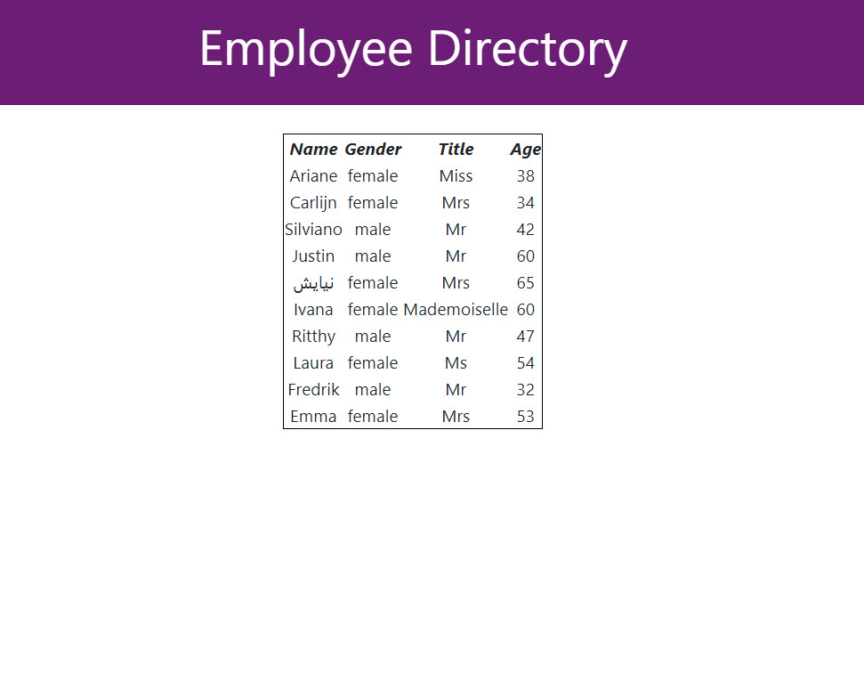

# JRM-HW19-UserDirectory

## User Story
* As a user, I want to be able to view my entire employee directory at once so that I have quick access to their information.

## Install and Deployment
* App is deployed through Git-Pages; the link is provided below.

[Git-Hub Pages](https://josephmartin721.github.io/JRM-HW19-UserDirectory/)

[Example Image](src/ExampleImage.jpg)

# My cool project and above is the logo of it